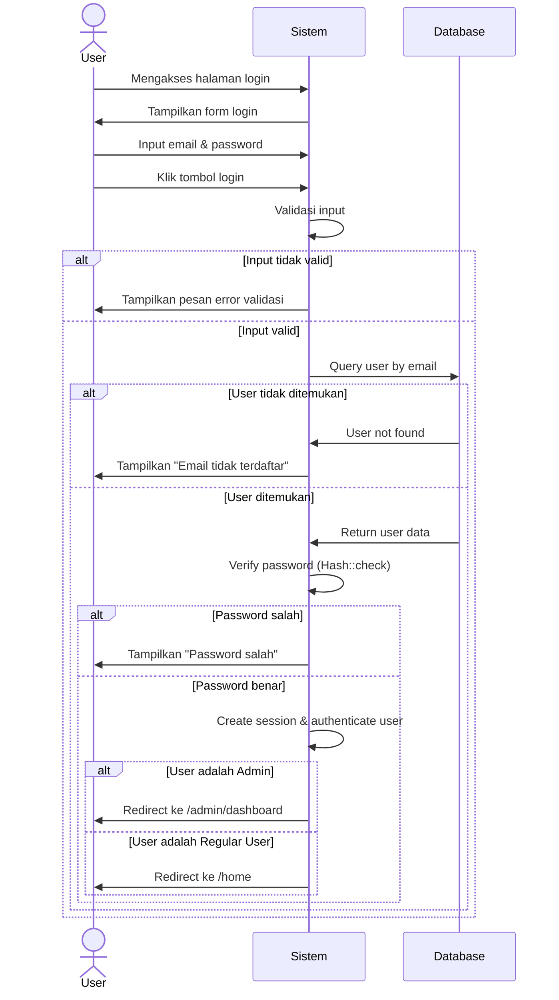

# Login Sequence Diagram

Diagram ini menggambarkan alur proses login pada aplikasi pelaporan bullying.



## Penjelasan Alur:

1. **Akses Halaman Login**: User mengakses halaman login
2. **Tampil Form**: Sistem menampilkan form login dengan field email dan password
3. **Submit Credentials**: User memasukkan email dan password, lalu submit
4. **Validasi Input**: Sistem memvalidasi format input (required, email format, dll)
5. **Cek Database**: Sistem mencari user berdasarkan email di database
6. **Verifikasi Password**: Jika user ditemukan, sistem memverifikasi password menggunakan hash
7. **Buat Session**: Jika password benar, sistem membuat session dan autentikasi user
8. **Redirect**: User diarahkan ke halaman sesuai role (admin → dashboard, user → home)

## Komponen yang Terlibat:

- **User**: Pengguna yang ingin login
- **Sistem**: Backend aplikasi Laravel (Controller, Middleware, Session)
- **Database**: Penyimpanan data user (tabel users)
```
