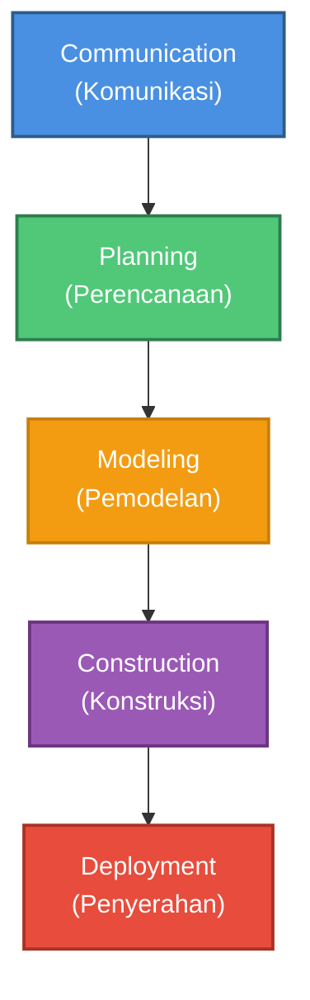

# Model Waterfall Menurut Pressman

Diagram ini menggambarkan tahapan-tahapan dalam model Waterfall menurut Roger S. Pressman.

## 📋 Penjelasan Setiap Tahapan:

### 1️⃣ Communication (Komunikasi)
**Tujuan**: Memahami kebutuhan stakeholder dan mendefinisikan tujuan proyek

**Aktivitas**:
- Inisiasi proyek
- Pengumpulan kebutuhan (*requirements gathering*)
- Wawancara dengan stakeholder
- Analisis kebutuhan pengguna
- Mendefinisikan ruang lingkup proyek

**Output**: Dokumen kebutuhan awal, pemahaman masalah yang akan diselesaikan

---

### 2️⃣ Planning (Perencanaan)
**Tujuan**: Membuat rencana kerja yang komprehensif untuk proyek

**Aktivitas**:
- Estimasi waktu dan biaya
- Penjadwalan proyek
- Analisis risiko
- Alokasi sumber daya
- Penetapan milestone
- Membuat Work Breakdown Structure (WBS)

**Output**: Project plan, jadwal, estimasi biaya, rencana manajemen risiko

---

### 3️⃣ Modeling (Pemodelan)
**Tujuan**: Membuat model sistem yang akan dibangun

**Aktivitas**:
- **Analysis Modeling**:
  - Membuat use case diagram
  - Membuat diagram alur data (DFD)
  - Mendefinisikan kebutuhan fungsional dan non-fungsional
  
- **Design Modeling**:
  - Desain arsitektur sistem
  - Desain database (ERD)
  - Desain interface pengguna (UI/UX)
  - Desain komponen dan modul

**Output**: Dokumen analisis, diagram sistem, desain database, mockup UI

---

### 4️⃣ Construction (Konstruksi)
**Tujuan**: Membangun sistem berdasarkan desain yang telah dibuat

**Aktivitas**:
- **Code Generation**:
  - Implementasi kode program
  - Pengembangan fitur
  - Integrasi komponen
  
- **Testing**:
  - Unit testing
  - Integration testing
  - System testing
  - Bug fixing

**Output**: Source code, aplikasi yang telah diuji, dokumentasi teknis

---

### 5️⃣ Deployment (Penyerahan)
**Tujuan**: Menyerahkan sistem kepada pengguna dan memastikan sistem berjalan dengan baik

**Aktivitas**:
- Instalasi sistem di lingkungan produksi
- Pelatihan pengguna (*user training*)
- Migrasi data (jika diperlukan)
- User Acceptance Testing (UAT)
- Penyerahan sistem kepada klien
- Pemeliharaan dan dukungan (*maintenance & support*)
- Evaluasi feedback pengguna

**Output**: Sistem yang berjalan di produksi, dokumentasi pengguna, laporan deployment

---

## 🔄 Karakteristik Model Waterfall:

### ✅ Kelebihan:
- Struktur yang jelas dan mudah dipahami
- Dokumentasi lengkap di setiap tahap
- Cocok untuk proyek dengan kebutuhan yang jelas dan stabil
- Mudah dalam manajemen dan monitoring progres
- Setiap fase memiliki deliverable yang jelas

### ⚠️ Kekurangan:
- Tidak fleksibel terhadap perubahan kebutuhan
- Feedback pengguna baru didapat di akhir proyek
- Risiko tinggi jika terjadi kesalahan di tahap awal
- Tidak cocok untuk proyek dengan kebutuhan yang dinamis
- Testing dilakukan di tahap akhir

---

## 📌 Kapan Menggunakan Waterfall?

Model Waterfall cocok digunakan ketika:
- ✔️ Kebutuhan sudah jelas dan stabil
- ✔️ Teknologi yang digunakan sudah matang
- ✔️ Proyek berskala kecil hingga menengah
- ✔️ Timeline dan budget sudah pasti
- ✔️ Dokumentasi lengkap sangat diperlukan
- ✔️ Tim sudah berpengalaman dengan domain proyek

---

## 📚 Referensi:
Pressman, R. S., & Maxim, B. R. (2014). *Software Engineering: A Practitioner's Approach* (8th ed.). McGraw-Hill Education.
